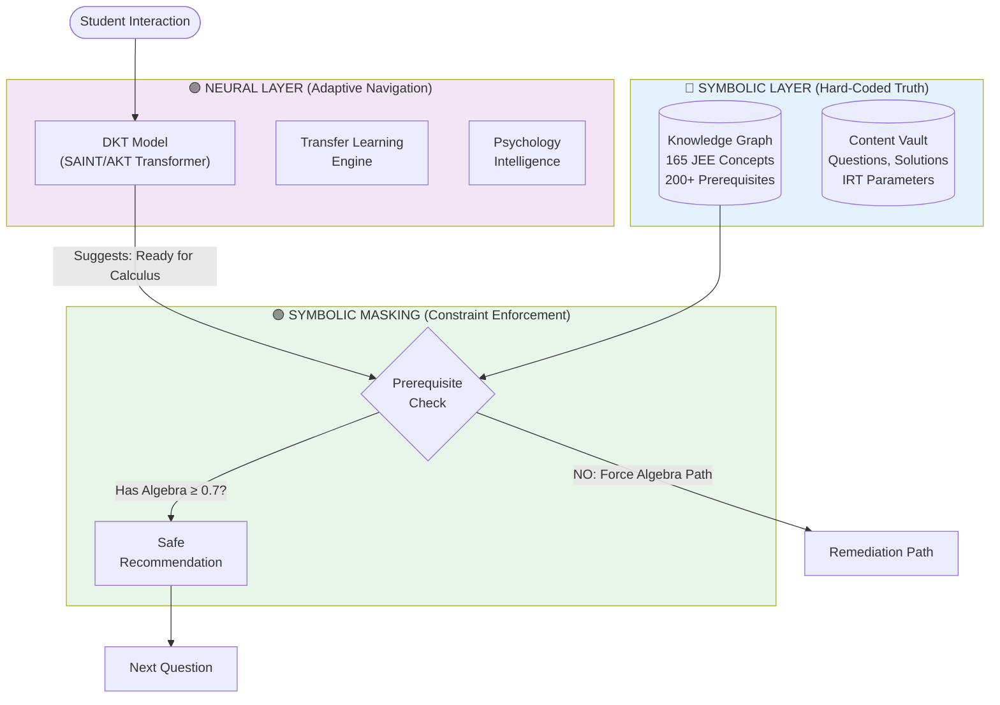
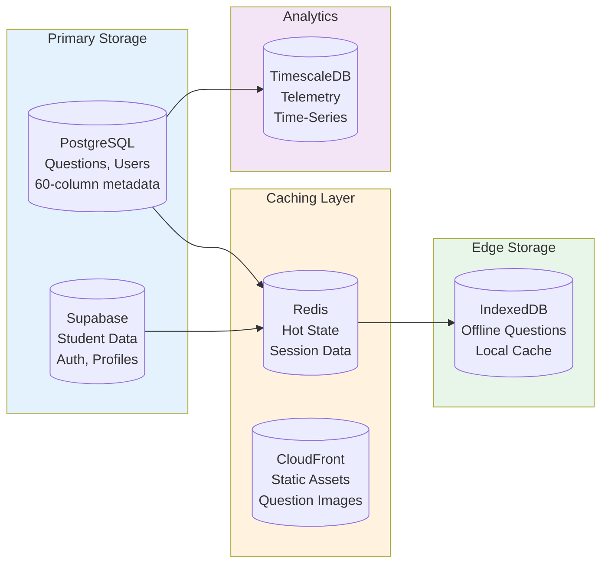
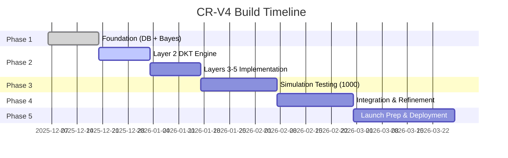

# 🏛️ CR-V4 COGNITIVE RESONANCE SYSTEM ARCHITECTURE
## Smart AI-Based JEE Coaching Platform - Master Reference

> **Version:** 4.0 | **Last Updated:** December 6, 2025  
> **Status:** Phase 1 Complete ✅ | Phase 2 Ready 🔄

---

## 📋 QUICK NAVIGATION

| Section | Purpose |
|---------|---------|
| [Core Philosophy](#-core-philosophy) | Why we build this way |
| [Algorithm Decision](#-algorithm-decision-dkt-not-bkt) | DKT vs BKT clarity |
| [Neuro-Symbolic Architecture](#-neuro-symbolic-hybrid-architecture) | The hybrid approach |
| [10-Layer System](#-10-layer-system-architecture) | Complete layer breakdown |
| [Data Architecture](#-data-architecture) | Database & caching |
| [Phase Roadmap](#-phase-wise-roadmap) | Build timeline |
| [Checklist](#-architecture-checklist) | Stay on track |

---

## 🎯 CORE PHILOSOPHY

```
┌─────────────────────────────────────────────────────────────┐
│                    CR-V4 CORE PRINCIPLES                     │
├─────────────────────────────────────────────────────────────┤
│  ✅ NEURO-SYMBOLIC    Neural adapts, Symbolic ensures truth │
│  ✅ DKT-BASED         Deep Knowledge Tracing (Transformer)  │
│  ✅ JEE-SPECIFIC      165 concepts, 3 subject strategies    │
│  ✅ PSYCHOLOGICALLY   Burnout detection, engagement arcs    │
│  ✅ EDGE-FIRST        TensorFlow Lite on student's phone    │
│  ❌ NOT CLASSIC BKT   Rejected: independence assumption     │
│  ❌ NOT BLACK-BOX ML  Rejected: unexplainable decisions     │
└─────────────────────────────────────────────────────────────┘
```

---

## 🧠 ALGORITHM DECISION: DKT NOT BKT

### ❌ WHY BKT IS REJECTED

| Problem | Impact on JEE |
|---------|---------------|
| **Independence Assumption** | Treats Calculus independent from Physics (WRONG) |
| **No Transfer Learning** | Can't model Newton's Laws → Circular Motion boost |
| **Shallow Temporal** | Misses long-term interaction patterns |
| **Single Concept Focus** | JEE needs cross-concept dependency modeling |

### ✅ WHY DKT IS CHOSEN

```mermaid
flowchart LR
    subgraph BKT["❌ Classic BKT"]
        B1[Single Question] --> B2[P(mastery)]
        B2 --> B3[Independent Skills]
    end
    
    subgraph DKT["✅ Deep Knowledge Tracing"]
        D1[Entire Sequence] --> D2[Transformer Encoder]
        D2 --> D3[Attention Mechanism]
        D3 --> D4[Cross-Concept Patterns]
        D4 --> D5[P(correct | next Q)]
    end
    
    BKT -.->|"Obsolete"| X[❌]
    DKT -->|"Chosen"| Y[✅]
```

**DKT Advantages:**
- Ingests **entire interaction sequence** (not single question)
- **Attention mechanism** captures concept relationships
- **Transfer learning** built-in via embeddings
- Runs on **edge devices** (TensorFlow Lite)

---

## 🔄 NEURO-SYMBOLIC HYBRID ARCHITECTURE

This is the **KEY** to understanding our system:



### The Three Layers Explained

| Layer | Role | Technology |
|-------|------|------------|
| **Symbolic** | Immutable truth (prerequisites, concept graph) | Neo4j/PostgreSQL |
| **Neural** | Adaptive pattern learning | DKT Transformer |
| **Masking** | Ensures structural correctness | Rule Engine |

**Why This Works:**
- **Neural** = Adapts to student patterns (DKT learns what works)
- **Symbolic** = Ensures mathematical correctness (can't skip prerequisites)
- **Combined** = "Conscious" + "Reliable"

---

## 📊 10-LAYER SYSTEM ARCHITECTURE

```mermaid
flowchart TB
    subgraph L1["Layer 1: Knowledge Graph"]
        KG1[165 JEE Concepts]
        KG2[200+ Prerequisites]
        KG3[Subject Strategies]
    end
    
    subgraph L2["Layer 2: AI Engine Core"]
        DKT2[DKT Transformer]
        TL2[Transfer Learning]
        QS2[Question Selector]
    end
    
    subgraph L3["Layer 3: Subject Strategies"]
        MATH[Math: Sequential-Mandatory]
        PHY[Physics: High-Yield Selective]
        CHEM[Chemistry: Breadth-First]
    end
    
    subgraph L4["Layer 4: Progressive Reveal"]
        PR[Concept Unlock Logic]
        OL[Overwhelm Prevention]
    end
    
    subgraph L5["Layer 5: Weekly Test Generator"]
        WT[25 Questions/Week]
        SR[Spaced Repetition]
    end
    
    subgraph L6["Layer 6: Monthly Benchmark"]
        MB[Fixed Test]
        GR[Global Ranking]
    end
    
    subgraph L7["Layer 7: Root Cause Analysis"]
        RC[Prerequisite Gap Detection]
        REM[Remediation Path]
    end
    
    subgraph L8["Layer 8: Percentile Mapper"]
        PM[Marks → Percentile]
        NTA[NTA Historical Data]
    end
    
    subgraph L9["Layer 9: Engagement System"]
        EA[6 Engagement Arcs]
        ML[Milestones]
    end
    
    subgraph L10["Layer 10: Psychology Engine"]
        BD[Burnout Detection]
        SI[Stress Interventions]
    end
    
    L1 --> L2
    L2 --> L3
    L3 --> L4
    L4 --> L5
    L5 --> L6
    L6 --> L7
    L7 --> L8
    L8 --> L9
    L9 --> L10
```



### Layer Details

| Layer | Name | Status | Key Deliverable |
|-------|------|--------|-----------------|
| **1** | Knowledge Graph | ✅ Schema Ready | 165 concepts, 200+ prerequisites |
| **2** | AI Engine Core | 🔄 Phase 2 | DKT + Transfer Learning + Question Selector |
| **3** | Subject Strategies | 🔄 Phase 2 | Math/Physics/Chemistry specific logic |
| **4** | Progressive Reveal | 🔄 Phase 2 | Concept unlock pacing |
| **5** | Weekly Test Generator | 🔄 Phase 2 | Personalized 25Q tests |
| **6** | Monthly Benchmark | 🔄 Phase 3 | Fixed global ranking tests |
| **7** | Root Cause Analysis | 🔄 Phase 3 | Gap detection & remediation |
| **8** | Percentile Mapper | 🔄 Phase 3 | Marks to rank estimation |
| **9** | Engagement System | 🔄 Phase 4 | Gamification, milestones |
| **10** | Psychology Engine | 🔄 Phase 4 | Burnout & stress detection |

---

## 🗄️ DATA ARCHITECTURE



### Database Tables (Phase 1 Complete)

| Table | Purpose | Status |
|-------|---------|--------|
| `concepts` | 165 JEE concepts metadata | ✅ |
| `concept_prerequisites` | 200+ relationships | ✅ |
| `misconceptions` | 300+ common errors | ✅ |
| `student_mastery_state` | Per-concept mastery | ✅ |
| `student_misconceptions` | Per-student tracking | ✅ |
| `student_attempts` | Immutable attempt log | ✅ |
| `engine_recommendations` | Decision audit log | ✅ |

---

## 🎯 LAYER 2 AI ENGINE DETAIL

```
┌─────────────────────────────────────────────────────────────┐
│                   AI ENGINE CORE (LAYER 2)                   │
├─────────────────────────────────────────────────────────────┤
│                                                              │
│  1. DKT ENGINE (Deep Knowledge Tracing)                     │
│     ├─ Transformer-based (SAINT/AKT architecture)           │
│     ├─ Input: Entire interaction sequence                   │
│     ├─ Learns: Cross-concept dependencies                   │
│     └─ Output: P(correct | next question)                   │
│                                                              │
│  2. TRANSFER LEARNING ENGINE                                │
│     ├─ Concept Relationship Matrix                          │
│     ├─ When Math mastery ↑ to 0.85                         │
│     ├─ Physics related concepts ↑ 0.06-0.08                │
│     └─ 25-35% study time reduction                         │
│                                                              │
│  3. QUESTION SELECTION ENGINE                               │
│     ├─ Multi-criteria optimization                          │
│     ├─ Mastery gap (40% weight)                            │
│     ├─ IRT difficulty matching (30%)                       │
│     ├─ Anti-repetition (20%)                               │
│     ├─ Bloom's taxonomy (5%)                               │
│     └─ Transfer learning boost (5%)                        │
│                                                              │
└─────────────────────────────────────────────────────────────┘
```

---

## 📅 PHASE-WISE ROADMAP



| Phase | Weeks | Focus | Deliverables |
|-------|-------|-------|--------------|
| **1** | 1-2 | Foundation | ✅ DB Schema, Bayesian base, CI/CD |
| **2** | 3-6 | Core Engine | DKT Model, Transfer Learning, Layers 1-5 |
| **3** | 7-9 | Simulation | 1000 synthetic students, validation |
| **4** | 10-12 | Integration | Full layer orchestration, debugging |
| **5** | 13-16 | Launch | DevOps, frontend, real users |

---

## ✅ ARCHITECTURE CHECKLIST

Use this to stay on track:

### Core Decisions (NEVER CHANGE)
- [x] DKT (Transformer) for knowledge tracing, NOT BKT
- [x] Neuro-Symbolic hybrid (Neural + Symbolic Masking)
- [x] 3 subject strategies (Math sequential, Physics high-yield, Chem breadth)
- [x] Edge-first (TensorFlow Lite on mobile)
- [x] PostgreSQL + Redis + TimescaleDB stack

### Phase 1 Complete ✅
- [x] 7-table PostgreSQL schema
- [x] 38 optimized indexes
- [x] Bayesian mastery foundation
- [x] GitHub CI/CD pipeline

### Phase 2 TODO 🔄
- [ ] DKT Transformer model (SAINT/AKT)
- [ ] Transfer Learning matrix
- [ ] Question Selection optimizer
- [ ] Layers 3-5 implementation
- [ ] Unit tests for each layer

### Red Flags (STOP if you see these)
- ⚠️ Using BKT independence assumption
- ⚠️ Treating concepts as isolated
- ⚠️ Skipping prerequisite checks
- ⚠️ Black-box ML without symbolic grounding
- ⚠️ Ignoring cross-concept dependencies

---

## 🔗 DOCUMENT REFERENCES

| Document | Purpose |
|----------|---------|
| `CR-v4-Quick-Reference-Guide.md` | High-level overview |
| `CR-v4-Production-Engineering-Blueprint.md` | Detailed layer specs |
| `CR-V4-Architecture-Diagrams.md` | Visual diagrams |
| `CR-V4-Engine-Build-Plan-Complete.md` | Phase timeline |
| `CR-V4-Phase1-Complete-Code.md` | Phase 1 implementation |

---

> **Remember:** Neural adapts, Symbolic ensures. DKT learns patterns, Knowledge Graph prevents mistakes. This hybrid is our competitive advantage.

---

*Last Updated: December 6, 2025 | CR-V4 Chief Architecture Council*
